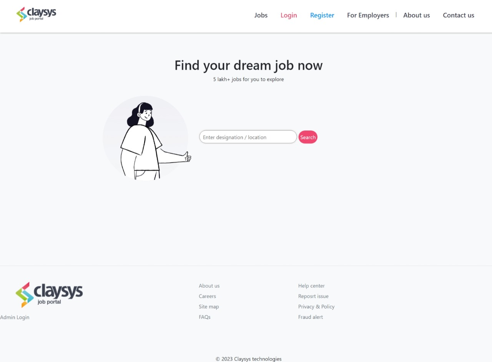
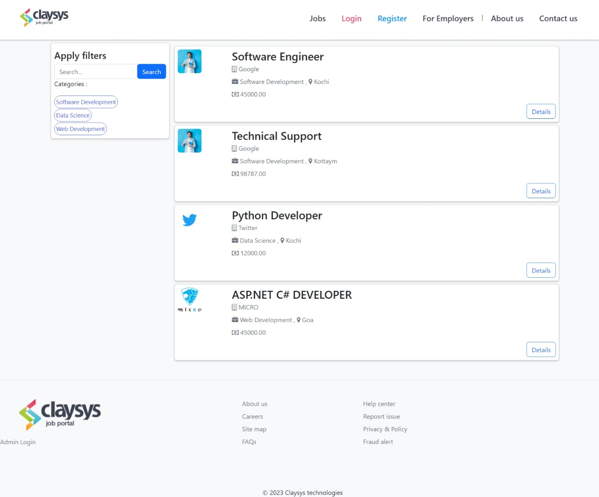
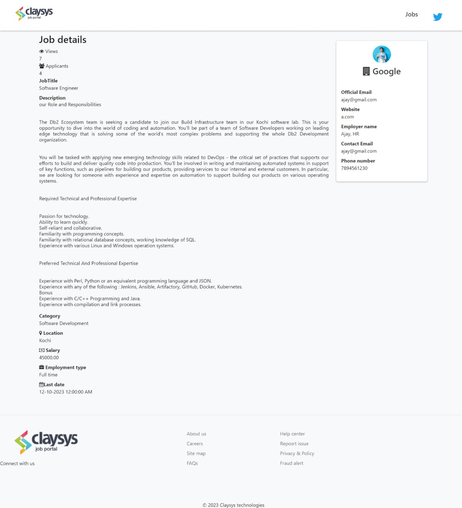
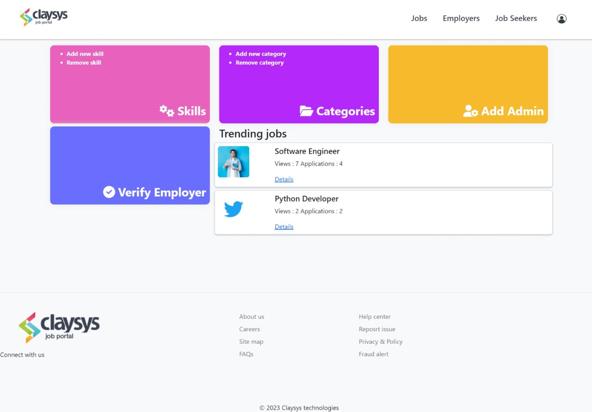
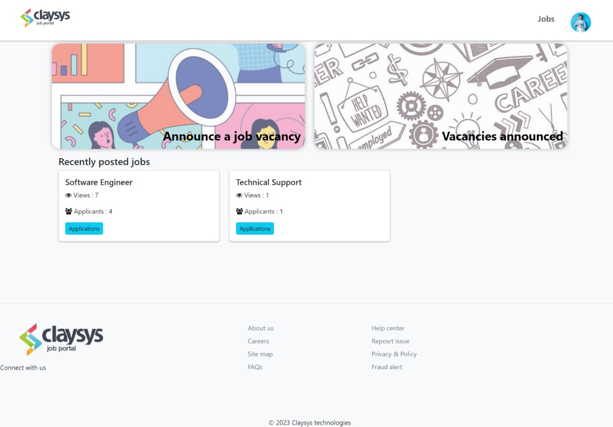
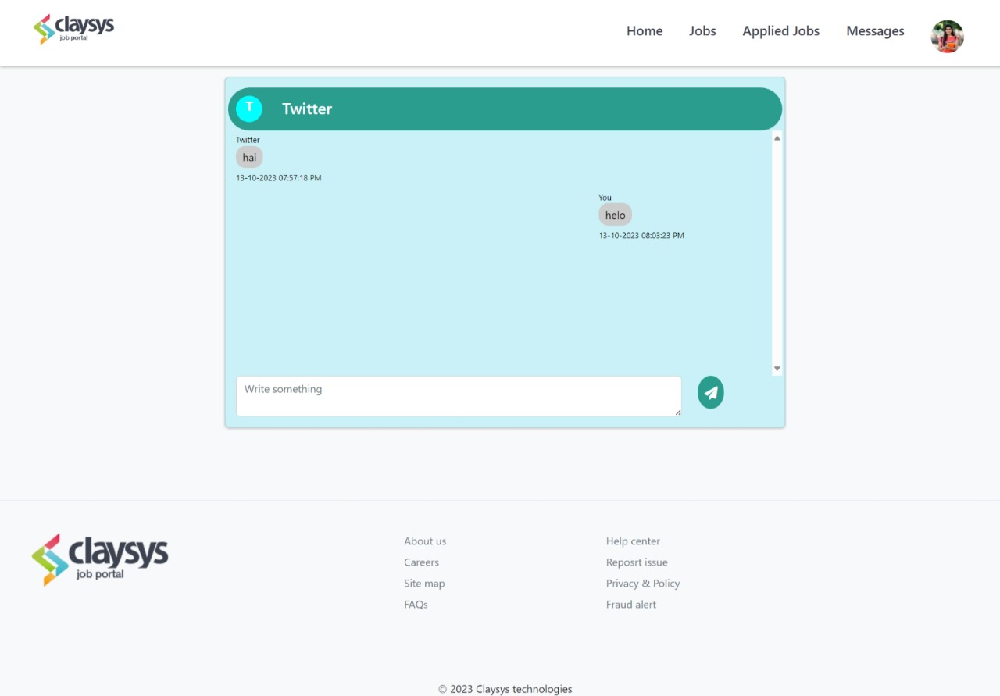

# Job Portal Web Application

The Job Portal Web Application is a dynamic online platform built using ASP.NET MVC, designed to connect job seekers and employers. It streamlines the job search and recruitment process, providing a feature-rich environment for both job seekers and employers to interact, post job vacancies, apply for jobs, and manage their profiles.

## Key Features

- **User Roles:** The application supports two primary user roles, "Job Seekers" and "Employers," each with distinct features and capabilities.

- **Job Listings:** Job seekers can browse and search through a comprehensive list of job vacancies posted by various employers. The listings can be filtered by categories, locations, and other criteria.

- **Application Process:** Job seekers can seamlessly apply for jobs by submitting their resumes and cover letters, while employers can review applications, contact applicants, and schedule interviews.

- **Bookmarks:** Job seekers have the ability to bookmark job vacancies, allowing them to save and revisit job opportunities that interest them.

- **User Profiles:** Both job seekers and employers can create and manage detailed profiles, including personal information, work experience, and educational backgrounds.

- **Education Details:** Job seekers can provide comprehensive information about their educational background, including schools, degrees, majors, graduation years, and GPAs.

- **Secure Authentication:** The application implements user registration and authentication to ensure data and account security.

- **Real-time Messaging:** A real-time chat system facilitates efficient communication between job seekers and employers.

- **Responsive Design:** The web application is designed to be responsive, ensuring a seamless experience on various devices, including desktops, tablets, and smartphones.

## Project Goals

- To simplify and optimize the job search and recruitment process.
- To provide an intuitive and user-friendly interface for job seekers and employers.
- To enhance communication and interaction between job seekers and employers.
- To offer a secure and dependable platform for job-related activities.

## Screenshots

The Job Portal Web Application aims to bridge the gap between job seekers and employers, making the job search and hiring process more efficient, effective, and user-friendly.

